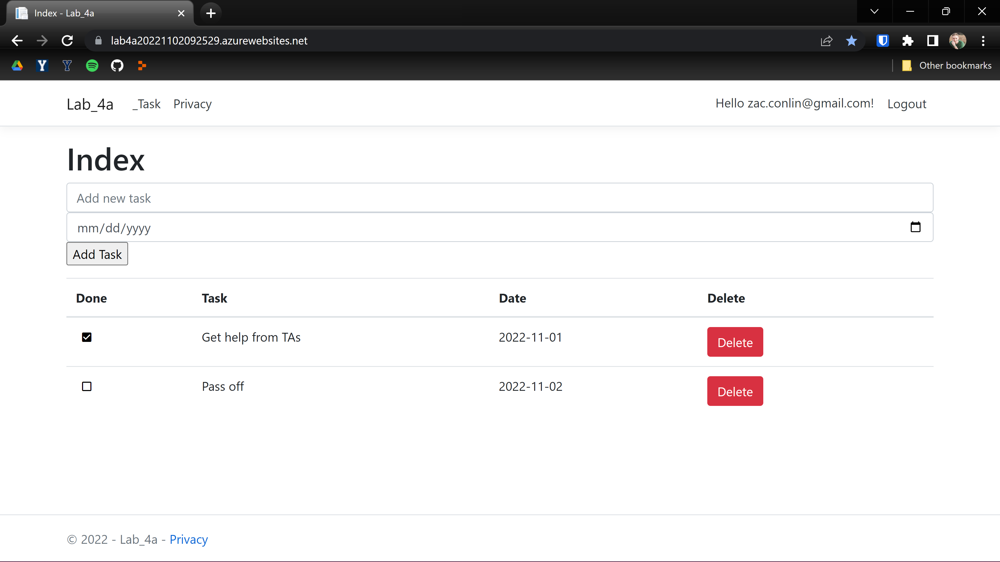
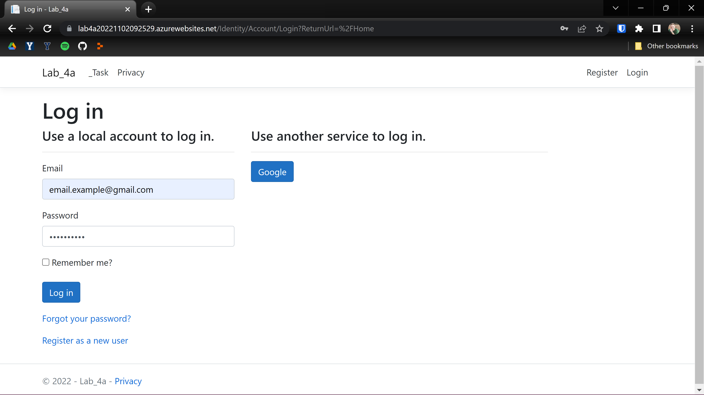
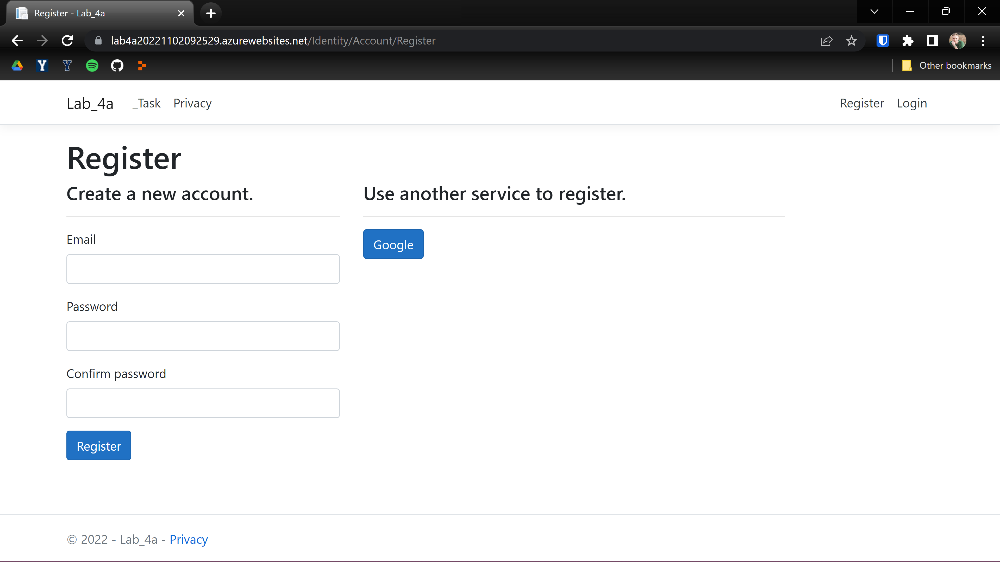
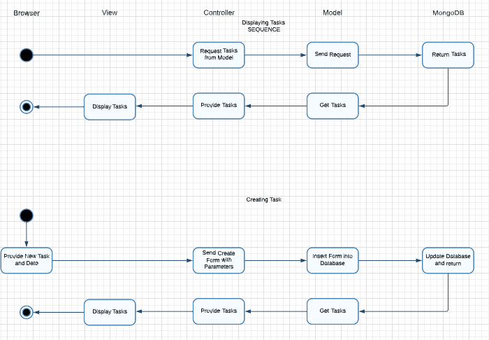
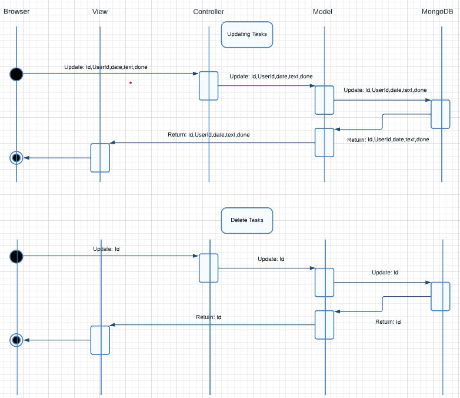

# Zac Conlin - 2 November 2022 - Lab 4

## II. Executive Summary:

In this lab, I created an Azure webpage to display a rudimentary checklist with the goal of implementing OAuth2 to allow users to register their accounts using Google, store their data in a NoSQL Database hosted in the cloud (MongoDB using Atlas), and utilize the C# Model-View-Controller framework to create, read, update, and delete tasks from a single page.

## III. Design Overview:

This lab aimed to accomplish what we've been doing in previous labs, but in a new way. Setting up Visual Studio 2022 took some time, but once it was accomplished it became clear how much more powerful an IDE is than a text editor like VS Code is. Running the boilerplate was easy as Microsoft built me a fully functioning (but blank) website. I eventually worked with it enough to look like this:

Fig 1: This is the main page that allows the user to create and view their tasks

The first thing I did after that was set up Google Authentication in ASP.NET Core. I had to add bits of code to several pages in order to force the authentication when opening the webpage. But at this point, I could register a user, and then log in with them whenever I needed to with either the normal email box, or the user could do it all by simply using their Google login!

Fig 2: Logging in - note that the user can use email OR can use gmail to log in for them

Fig 3: Registering a new user. Again, note that Google can be used to create a user easier.

This lab made use of a NoSQL Database in the Cloud to store all the data. I used mongoDB Atlas to accomplish this. I learned about Data Access Object Models and implemented one in my database in order to call the functions on my Database Context object.

I then had to add a controller in order to interact with the view and with the database. Then the Create, Read, Update, and Delete functions could be implemented. After learning how C# worked, I was able to get these functions working successfully with my database, and ended up with a functional webpage! Here are UML Diagrams of the logic of each of the CRUD functions:

Fig 4: Read and Create UML diagram

Fig 5: Update and Delete UML diagram

After publishing the page to Azure, it is now up and running and is accessible to anyone who needs a simple page to keep track of tasks!

## IV. Questions:

### Lab 4a Questions

- In the context of MongoDB compared to SQL databases, what's a Document? What's a Collection?
    - A database contains collections, collections - which is the equivalent of a table in a SQL database, contain documents, and documents contain data as field-value pairs or key-value pairs.
- When you log in with Google, where is the hash of your password stored? Your app, Google, or both?
    - The hash is stored just in google, it doesn't need to store it in my app 
- What's the difference between using Cloud services to store data (like Atlas) and storing data locally with something like MySQL? List 2 benefits of each approach.
    - For one, storing it on the cloud is convenient because it can be accessed from anywhere, and it is also recoverable if something happens to your hardware (i.e. your PC breaks, you dont lose your data because it is on the cloud)
- List 3 core features of fully-fledged IDE's like Visual Studio that give them an advantage over text-editors like Sublime or VSCode.
    - IDEs have Debuggers, automation (like easy navigation functionality, code auto-completion, class explorers, and hierarchy diagrams), and specific language support (For example, XCODE, Apple's native IDE, has support for the languages that are used to work in Apple products.)

### Lab 3b Questions

- What is the role of a Model?
    - The model is what passes and manipulates the data between the database and the user
- What is the role of a View?
    - The view is used for all the User Interface actions, it is what the user interacts with
- What is the role of a Controller?
    - Passes data between the model and view components and processes the logic and requests.
- List 3 pros and 3 cons of hosting your website on the cloud.
    - Advantages:
        Flexible and scalable, cost efficient because you don't pay for unwanted resources, and updated with the latest and best technology available.
    - Disadvantages: Could be slower because of distance and traffic, unavoidable potential downtime, and increasingly vulnerable to cyber attacks. 

## V. Lessons Learned:
*Problem 1*

While attempting to publish the site, there could be an error saying "Could not authenticate [user]. In order to fix this, ensure that while creating the admin account for the database, there are no semicolons in the username or password, as this escapes the input and ends the line. Thus the password and hash will not match.

*Problem 2*

When changing locations, the developer may notice that they no longer have access to their Azure webpage. This is because they have not yet included the IP address in the whitelist for mongoDB and will be restricted access from this unknown IP.

*Problem 3*

If the update doesn't apply to every task, instead with the checkbox appearing in the top column with the title, then the logic is in the wrong block of HTML. The one that it should be in is the section that says @foreach, that will apply it to every line that ends up in the database.

## VI. Conclusions:

### Skills Acquired
- Code in C#
- Host a website on the cloud
- Use and adjust a Visual Studio boilerplated project

### References
How to get started with MongoDB: https://www.mongodb.com/docs/manual/tutorial/getting-started/

How to get current user ID in .NET Core: https://stackoverflow.com/questions/30701006/how-to-get-the-current-logged-in-user-id-in-asp-net-core

Help understanding what MVC framework is: https://www.tutorialspoint.com/mvc_framework/mvc_framework_introduction.htm