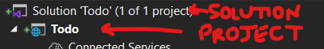

# Lab 4A - .NET Core MVC Part 1

## Overview

Now that we've had experience writing in HTML, CSS, JavaScript, PHP, and we've set up our very own database server, we will continue by learning the __Model-View-Controller__ ideology (__MVC__).

| Term | Definition |
| ---- | ---------- |
| Model | The __Model__ is simply a local representation of what the database looks like. In our case, the Model will include a __class__ called `_Task`. If you don't know, a __class__ in __Object-Oriented Programming__ (__OOP__) is just a "cookie-cutter" for creating Objects in a given language. That way, any time we need a new `_Task` Object, we'll know it's the same as every other `_Task` Object, just with different data. |
| View | The __View__ is where we keep our HTML (and CSS). In Microsoft's .NET Core, the HTML in the views have special syntax and are called Razor Pages, with `.cshtml` as the file extension. If you'll notice, it's a combination of the `.cs` file extension for C#, and the `.html` file extension for HTML. The unique thing about Razor Pages is that you can put C# right inside your HTML, which is how we customize what's on the page. |
| Controller | The __Controllers__ contains the bulk of the code for the website. A Controller uses the Model to know what's available to present to the View. You could call the Controller the brain of the application, where all of your logic will be kept. |

### Functionality

- Use OAuth2 to allow users to register their accounts using Google
- Store data in a NoSQL Database hosted in the cloud (MongoDB using Atlas)

### Concepts

- Cloud Services: Hosting, Databases, etc.
- NoSQL Databases (MongoDB)
- OAuth 2

### Resources

- [Create an ASP.NET MVC 5 App with Facebook, Twitter, LinkedIn and Google OAuth2 Sign-on (C#)](https://docs.microsoft.com/aspnet/mvc/overview/security/create-an-aspnet-mvc-5-app-with-facebook-and-google-oauth2-and-openid-sign-on)
- [Google external login setup in ASP.NET Core](https://docs.microsoft.com/aspnet/core/security/authentication/social/google-logins?view=aspnetcore-2.2)
- [Create a web API with ASP.NET Core and MongoDB](https://docs.microsoft.com/aspnet/core/tutorials/first-mongo-app?view=aspnetcore-2.2&tabs=visual-studio)

### Assignments

Lab Writeup Instructions are in the "Content" tab in [Learning Suite](http://learningsuite.byu.edu).

# Instructions

## Step 1: Set up a student account with Microsoft Azure

1. Navigate to the following website and click "`Start free`":

    - [Start building the future with Azure for Students!](https://azure.microsoft.com/en-us/free/students/)

1. Sign in with your `NetID@byu.edu` email that's given to you by BYU

    - (Your password will be the password you use to log in to Learning Suite or MyMap)

1. Take notice, you receive $100 in credit that you can use on Azure. Be very careful not to spend it all before the project is done.

1. Once you click through all of the login and agreement screens, you'll be brought to your dashboard

> Note: This is going to be your Production Environment (or "Live Server") for this project.

## Step 2: Install Microsoft Visual Studio

> Important: If you have a Mac, we suggest using a Lab Computer to complete this project. Visual Studio 2019 is available for OSX, but it takes a lot more work to be able to develop our project on it. There will be no extra credit given for any extra work you'll endure should you choose to try and do this using Visual Studio for Mac.

Microsoft Visual Studio (not to be confused with Microsoft Visual Studio _Code_) is a robust IDE with support for a large number of languages and projects. You can build mobile apps, universal windows apps, games, micro-services, etc., and seamlessly deploy and track them through the interface.

1. Browse to [https://visualstudio.microsoft.com/vs/](https://visualstudio.microsoft.com/vs/)

2. Click "Download Visual Studio" and select the version you wish to install.

    - If you already have a version of Visual Studio installed (Professional or Community), you might want to uninstall that one first to make sure you have the latest updates and the right packages included. Or, if you have already installed Visual Studio **2022**, you can select `help - check for updates` to ensure you have the latest updates installed. Then you can re-run the installer to ensure the `ASP.Net and web development` and `Azure development` packages are installed (see below).

    - Choosing a version:
        - Enterprise Edition is made available to you through BYU. It has the most functionality and is normally quite expensive.
        - Community Edition is free for anyone and includes everything you will need for this class.
        - The website has a chart you can use to compare editions. The main differences are team coordination and automated testing features.
        - If you already have a version of Visual Studio, you can sign in as `NetID@byu.edu` and run the Visual Studio Installer, where you'll see that Visual Studio Enterprise is available to you

    - Make sure to include these packages during the install:


3. Click on the `Individual Components` tab at the top of the window and make sure `.NET Core 3.1 Runtime (LTS)` is checked, then click Install

> Note: Visual Studio is a large install, so it may take some time.
>
> If you want to add these packages to an existing installation or install any of the other packages later, you can run Visual Studio Installer again by clicking the "Tools" menu at the top of the window and then selecting "Get Tools and Features...".

## Step 3: Setting up Git
To be able to push this Visual Studio project to the correct GitHub repository you accepted on Learning Suite you need to follow these steps. 
1. On the splash screen that opens when you first run Visual Studio, click on "Clone a repository".
   
3. Enter the URL of your github repository under "Repository location" and select where you want it to be cloned under "Path".
> After you make your project in step 4:
> * You can take care of your version control by checking out the "Git Changes" tab (usually found at the bottom of the Solution Explorer section) in Visual Studio.
> * You can also find the "Git Changes" tab by going to View > Git Changes.

## Step 4: Run the boilerplate

> Note: __Boilerplate__ is a jargony term that just means a basic project structure that's already set up for you.

Microsoft has pre-written a lot of what you'll need to create a .NET Core application, so we'll let them do that for us.

1. Once Visual Studio has finished cloning your repository, click `File > New > Project`.

2. Select `ASP.NET Core Web App (Model-View-Controller)`, make sure the language is C#, and click `Next`

    

3.  Name the application and select to save it in the location of your lab-4a cloned repository. Make sure this is inside of the repository you just cloned, then click `Next`

4. In the new dialogue, make sure ".NET Core 3.1 (Long-term support)" is selected for the Target Framework

    > Note: This screen may be empty with a warning about not having `dotnet` in your `PATH` variable. Just click the provided link and follow the instructions to set that up, then restart Visual Studio Community and repeat from step 1.

5. Select "Individual Accounts" for the Authentication type
    

6. Click `Create`

Now watch as Microsoft builds you a fully-functioning website!

You can run it by clicking the green play button at the top of Visual Studio!

When running your website if you see either of these warning messages select `YES`:


### Google Authentication

Before moving on, we need to set up our Google Authentication API. To work with outside services, you usually need to register with them so that they know who's using their servers. In return, you'll get a key (a string of numbers and letters) which will allow your application to receive information from their servers. We'll get the key and set up our authentication.

Reference: [Google external login setup in ASP.NET Core](https://docs.microsoft.com/en-us/aspnet/core/security/authentication/social/google-logins?view=aspnetcore-3.1)

1. Select your project in the `Solution Explorer` in Visual Studio (it should be the first thing nested inside of the Solution), and press <kbd>Alt-Enter</kbd>/<kbd>Opt-Return</kbd>

    
    - Select the `Debug` tab, then click `Open debug launch profiles UI`
    <br>
    - Find the URL under `App SSL URL`. You will use this URL in step 3.
    <br>

2. Log in to Google's [Developer Console](https://console.developers.google.com). Create a new project, and call it something appropriate (like `ITC 210 Google Auth`). It will generate a project ID for you.

3. Go to the [Credentials](https://console.developers.google.com/apis/credentials) page for your project. This page can also be found by clicking on `APIs & Services` in the side menu, then `Credentials`.

    - Make sure you have the project you created in the last step selected (`ITC 210 Google Auth`)
    - Click `Create credentials` then `OAuth client ID`
        - If it forces you to set up your consent screen at this point select `External` as the User type, enter your email where it asks for it, and leave the rest of the settings alone. Click `Save and Continue` until the Consent Screen setup is finished. Then click `Back to Dashboard` then, click on `Credentials` again and click `Create Credentials` then `OAuth client ID`.
    - Select `Web application` as the application type
    - Specify a name for your client
        - e.g. `ITC 210 Todo App`
    - Click `Create`
        > Note: This created a unique client ID that we will use later to integrate Google Sign-in into our Visual Studio web application
    - Reopen your newly created `ITC 210 Todo App` OAuth2.0 clientID
    - Under the `Authorized redirect URIs` heading, paste in the URL you copied in step 1 from Visual Studio and add `sign in-google` so the full path looks something like this:
        - `https://localhost:44373/signin-google`
        - Click `Save`
    - Click the `Download OAuth Client` button, then click the `Download JSON` link, rename the download to something like `credentials.json` and save this file somewhere __OUTSIDE__ of your project
        - We don't want these credentials to be on GitHub

4. Right-click on your project in Visual Studio and select `Manage User Secrets`

    - Paste the following into that file, replacing the `<>` sections with the appropriate values from the `credentials.json` file you just downloaded
    - There should be __no angle brackets__ in the quotation marks
      ```json
      {
         "Authentication": {
            "Google": {
              "ClientId": "<string of letters and numbers>.apps.googleusercontent.com",
              "ClientSecret": "<string of letters and numbers>"
            }
         }
      }
      ```
      > Note: This file will not be saved with your Git repository. Remember to save your `credentials.json` somewhere safe, where you'll remember it.

5. Install the appropriate NuGet Package for Google Auth

    > Note: __NuGet Packages__ are libraries of pre-written C# functions for you to use in your application. The one we're using will make it easy for us to work with our MongoDB Atlas database.

    - In Visual Studio, at the top of the window, select `Project > Manage NuGet Packages`
    - Click the `Browse` tab
    - Search for the following:
      ```
      Microsoft.AspNetCore.Authentication.Google
      ```
    - Select the first result.
    - In the panel on the right, select `Version` **3.1.12**, then click `Install`
    - Click through the dialogs that pop up

6. In your Solution Explorer, open `Startup.cs` (usually found at the bottom)

    - Find the function called `ConfigureServices()`
    - Add the following code:

      ```cs
      services.AddAuthentication()
         .AddGoogle(options =>
         {
            IConfigurationSection googleAuthSection = Configuration.GetSection("Authentication:Google");

            options.ClientId = googleAuthSection["ClientId"];
            options.ClientSecret = googleAuthSection["ClientSecret"];
         });
      ```

      > Explanation: Here you are adding Google as an authentication option for your website. You defined the `ClientId` and `ClientSecret` in your `secrets.json` file. the `Configuration` variable automatically looks at `secrets.json` and `appsettings.json` and translates the JSON into usable C# Objects, which you then use to set the options for your new Google Authentication service.

### Force Authentication

Before you display your app, you want to make sure a user is logged in. That way, your task list will be secure.

Use [this website](https://docs.microsoft.com/en-us/aspnet/web-api/overview/security/authentication-and-authorization-in-aspnet-web-api#using-the-authorize-attribute) to find a simple way to block access to the main page of your application if a user is not logged in. (You only need to add one line and a namespace to protect the Index view of the Home Controller).

### Test your login
There will be two ways to log in to your application: with google or manually with the basic login functionality provided by the .NET framework. When testing the non-google login DO NOT register your real Gmail addresses because that will cause conflict when you decide to use that email for a google authentication login. If you want to test the manual login, make up some fake email like `test@whatever.net` and create a new password. You will notice by default the .NET framework requires an algorithmically complex password.

There might be some issues with your login. First, the redirect URI could be mismatched. Make sure to change it on Google's Developer Console to match what your MVC application is expecting.

Another issue that's been reported is the following error:


Simply click <kbd>Apply Migrations</kbd> to fix the error.

It will also tell you that there is no actual emailer service. Don't worry about that for this project. For now, we'll just use the default registration confirmation page that is shown. 

Make sure to confirm your email on the default confirmation page when you first register your email to avoid problems down the line. 

## Step 5: Setup a NoSQL Database in the Cloud

Now that we have our website ready to develop, we need to connect it to a database. We'll use MongoDB so that we have practice using a NoSQL database. Fortunately, they have a free cloud-hosted service called [MongoDB Atlas](https://www.mongodb.com/cloud/atlas) that we can use to set it all up.

### Setup Atlas

We'll be using [mongoDB Atlas](https://www.mongodb.com/cloud/atlas) to store our NoSQL data.

In Atlas, we will set up a new database, create a new collection, add some data, and finally create a user that has access to it to be able to read and write data to the database.

1. Create an account, and it will take you to a page called `Deploy a cloud database`
2. Select "Shared"

    - Make sure you choose a server in the "Shared" tab unless you want to pay for this database
    - For example, choose `Google Cloud Platform`, and select the `Iowa (us-central1)` server

3. Name your cluster if you want, then click the `Create Cluster` button on the bottom of the screen

4. Once you are logged in, you'll see that Atlas will be setting up your database for you. It may take several minutes.

5. Once the setup has been completed, click on the `Database` tab on the left menu, then `Browse Collections`, and `Add My Own Data`

    - Call the database `Todo`, and call the collection `Tasks`
      - __The casing is super important. It's called Pascal Case, and you should use it.__
    - __Don't__ check the box marked `Capped Collection`

6. Select `Database Access` from the `Security` sub-section in the left side menu

    - Click the `Add New Database User` button
    - Enter a username and a password
      - Username can be something like `todo-user`
      - Make the password something easy for testing
    - __Remember the username and password for later__
    - Make sure the "Database User Privileges" has "Read and write to any database" selected
    - Click `Add User`

7. Select `Network Access` from the `Security` sub-section in the left side menu

    > Note: You'll have to do this every time you move your computer to a new network unless you allow access from anywhere, which is NOT a good idea.
    - Click the `Add IP Address` button
    - Click `ADD CURRENT IP ADDRESS` and add a comment to say which network your computer is on currently (If you're in the lab, you can say "IT Lab" or something like that)
    - Click `Confirm`

### Install the Package

Now you can connect your web application to your database. To do that, you need to download a NuGet package called `MongoDB.Driver`.

1. In Visual Studio, at the top of the window, select `Project > Manage NuGet Packages`

2. Select the `Browse` tab

3. Search for the following package:

    ```
    MongoDB.Driver
    ```

4. Select the corresponding package in the search results

6. On the right side, click `Install`

7. Click through any remaining dialogues

### Set and Access Your Atlas Settings

1. In Visual Studio, in your Solution Explorer, open the `appsettings.json` file (found towards the bottom) and add the following section to the list:

    ```JSON
    {
      //...
      "AtlasSettings": {
         "Database": "Todo",
         "Collection": "Tasks"
      }
    }
    ```

    > IMPORTANT: These need to match what you did when setting up Atlas.

2. On the Atlas Dashboard in your browser, click the `Databases` link on the left side menu

    - Click `Connect` on the cluster you made for this project
    - Select `Connect Your Application`
    - For `Driver`, select `C# / .NET`
    - For `Version`, select `2.5 or later`
    - Click `Copy` to copy the connection string

3. In Visual Studio, right-click the project in Solution Explorer and select `Manage User Secrets` and add the following section to the list:

    ```JSON
    {
      //...
      "AtlasSettings": {
         "ConnectionString": "<paste the connection string here>"
      },
    }
    ```
    > Note: Once again, remember that the angle brackets (`<>`) should not be there.

4. Replace `<password>` in the connection string above with the password for the username you chose when you created your user on the Atlas Dashboard.

5. Replace `<dbname>` (found towards the end, after the slash `/`) with the name of your database.

    > Explanation: The password is sensitive, so we want to keep the connection string with our Google API keys that we stored in the `secrets.json` file, which is not attached to our Git repo. That means when you move this website to a production server, you'll need to add these details into a new `secrets.json` file that will only be found on your production server.

### Create a Model for Atlas Settings

1. In the Solution Explorer, right-click on the `Data` folder, and select `Add > Class...`

    - In case it's not already selected, you'll want to select `Visual C# > ASP.NET Core > Code` on the left, and then select `Class` in the middle
    - Name the class the same as the JSON section you just added to `secrets.json`: `AtlasSettings.cs`
    - Click `Add`

2. Make the code in `AtlasSettings.cs` look like the following once it's created:

    ```cs
    namespace <your project name should go here without angle brackets>.Data
    {
      public class AtlasSettings : IAtlasSettings
      {
         public string Collection { get; set; }
         public string Database { get; set; }
         public string ConnectionString { get; set; }
      }
      public interface IAtlasSettings
      {
         string Collection { get; set; }
         string Database { get; set; }
         string ConnectionString { get; set; }
      }
    }
    ```

    > Note: The namespace is already generated correctly for you. If you just copy and paste the above code, it won't work.

    > Explanation: You're creating a C# Class that has the same structure as your JSON in `appsettings.json` and `secrets.json`. .NET Core will automatically put the `ConnectionString` and the `Database` and `Collection` values in the same `AtlasSettings` object, even though they're stored in different places, so you don't have to worry.

3. In Solution Explorer, open `Startup.cs`

    - Add the following line to the top:
    ```cs
    using Microsoft.Extensions.Options;
    ```
    - Find the `ConfigureServices()` function, and add the following code inside of that function:
    ```cs
    services.Configure<AtlasSettings>(Configuration.GetSection(nameof(AtlasSettings)));
    services.AddSingleton<IAtlasSettings>(sp =>
      sp.GetRequiredService<IOptions<AtlasSettings>>().Value);
    ```
    > Explanation: Here, much like when you added the Google Auth service, you are adding the `AtlasSettings` to your configuration, so that you can access it in your controllers.

### Create a Model for Tasks

When you store data in a NoSQL database, it's possible to mess up your data by adding a new task that has a misspelled key, e.g. "text" instead of "Text".

One solution to this is to create a Model (a C# class) to make sure the keys are the same every time you interact with the database.

1. In Visual Studio, right-click the `Models` folder, and select `Add > Class...`

    - Name the new class `_Task.cs`
    - Click `Add`

        > Note: We use the name `_Task` instead of `Task` to avoid a collision with the `System.Threading.Tasks.Task`, which will be used in other files in the project.

2. Use [this example](https://docs.microsoft.com/en-us/aspnet/core/tutorials/first-mongo-app?view=aspnetcore-3.1&tabs=visual-studio#add-an-entity-model) to help you create a Model in C# for a MongoDB Model Class, and fill in your class with the following properties:

    - Id
    - UserId
    - Text
    - Done
    - Date

    > Note: Make sure you use the proper data types for each of these properties, and also make sure you are using PascalCase for the variable names (like camelCase, but with a capital first letter). Take out the line `[BsonElement("Name")]`.

    > Explanation: Your code should include 2 lines: `[BsonId]` and `[BsonRepresentation(BsonType.ObjectId)]`, which tell the MongoDb Driver that the `Id` field will be automatically generated and handled. Any time you see square brackets in this fashion, they all refer to the first line below them that isn't square brackets, in this case, the `Id` declaration. 

Now you have a C# representation of the data in your Atlas database!

### Create a Database Context

Earlier, we installed `MongoDB.Driver`, but we haven't used it yet. We need to create what's called a __Database Context__, which is an Object that calls the functions provided by `MongoDB.Driver`.

In Visual Studio, create a new Class in the `Data` folder called `MongoDbContext.cs` and paste the following code into the new file:

```cs
using <your project name should go here without angle brackets>.Models;
using MongoDB.Driver;

namespace <your project name should go here without angle brackets>.Data
{
  public class MongoDbContext
  {
     private readonly IAtlasSettings _settings;
     private readonly IMongoDatabase _db;

     public MongoDbContext(IAtlasSettings settings)
     {
        _settings = settings;
        var client = new MongoClient(_settings.ConnectionString);
        _db = client.GetDatabase(_settings.Database);
     }

     public IMongoCollection<_Task> Tasks
     {
        get
        {
          return _db.GetCollection<_Task>(_settings.Collection);
        }
     }
  }
}
```

> Explanation: The __constructor__ for the `MongoDbContext` class takes an `AtlasSettings` object, which allows it access to the JSON settings we created earlier.

### Create a Data Access Object Model

A __Data Access Object__ is a jargony term that just means an Object that calls the functions on your Database Context object. The real important reason we need this class is to handle exceptions (errors) so we don't have to do that in the Controllers.

1. Right-click the `Data` folder in the Solution Explorer and select `Add > New Folder`

    - Name the new folder `Dao`, which means "Data Access Object"

2. Right-click the new `Dao` folder and select `Add > Class...`

3. Name the class `TaskDao.cs`

4. Copy and paste the following code into the file, replacing `<your project name should go here without angle brackets>` with the name of your app:

    ```csharp
    using MongoDB.Driver;
    using System.Collections.Generic;
    using System.Threading.Tasks;
    using <your project name should go here without angle brackets>.Models;

    namespace <your project name should go here without angle brackets>.Data.Dao
    {
        public class TaskDao : ITaskDao
        {
            private readonly MongoDbContext _db;
            public TaskDao(IAtlasSettings settings)
            {
                _db = new MongoDbContext(settings);
            }
            public async Task Create(_Task task)
            {
                try { await _db.Tasks.InsertOneAsync(task); }
                catch { throw; }
            }
            public async Task Delete(string id)
            {
                try
                {
                    FilterDefinition<_Task> data = Builders<_Task>.Filter.Eq("Id", id);
                    await _db.Tasks.DeleteOneAsync(data);
                }
                catch { throw; }
            }
            public async Task<_Task> Get(string id)
            {
                try
                {
                    FilterDefinition<_Task> filter = Builders<_Task>.Filter.Eq("Id", id);
                    return await _db.Tasks.Find(filter).FirstOrDefaultAsync();
                }
                catch { throw; }
            }
            public async Task<IEnumerable<_Task>> Read(string UserId)
            {
                try
                {
                    FilterDefinition<_Task> filter = Builders<_Task>.Filter.Eq("UserId", UserId);
                    return await _db.Tasks.Find(filter).ToListAsync();
                }
                catch { throw; }
            }
            public async Task Update(_Task task)
            {
                try { await _db.Tasks.ReplaceOneAsync(filter: g => g.Id == task.Id, replacement: task); }
                catch { throw; }
            }
        }

        public interface ITaskDao
        {
            Task Create(_Task task);
            Task Delete(string id);
            Task<_Task> Get(string id);
            Task<IEnumerable<_Task>> Read(string UserId);
            Task Update(_Task task);
        }
    }
    ```

    > Explanation: An __Interface__ simply defines what an Object needs to be of the associated class. Because `TaskDao` inherits from `ITaskDao`, the functions have to be implemented in the class declaration. [Read more about interfaces here](https://docs.microsoft.com/dotnet/csharp/language-reference/keywords/interface).

## Conclusion

In this tutorial, you installed a full __Integrated Development Environment__ and learned about some of the benefits of using one instead of an advanced text editor like Visual Studio Code or Sublime.

You used Visual Studio to "boilerplate" a project for you and learned how to make adjustments to pre-generated code.

You learned how to gain access to Google's APIs, and set up a connection whereby you can use Google to log in to your website.

You created a NoSQL database that's hosted on the cloud and accessible anywhere, as long as you have the connection string. You learned that a back-end is necessary for NoSQL databases to ensure consistency of the data.

You laid the foundations for your website to be able to communicate with that database in preparation for creating a Controller and Views to manipulate that data.

# .NET Core MVC Part 1 Pass-off

- [ ] 10 Points - UML Sequence diagram, in digital from, showing functionality of Google Authentication
- [ ] 10 Points - Code is backed up on GitHub through Visual Studio
- [ ] 10 Points - There are no visible connection strings or passwords in the GitHub Repository (other than the one that comes with the app)
- [ ] 10 Points - Users can register new accounts using their email or Google
- [ ] 10 Points - Users can login using their email or Google
- [ ] 10 Points - Users cannot see the Welcome screen unless they are logged in
- [ ] 5 Points - There is a Model for a Task that includes the proper properties and proper visibility
- [ ] 5 Points - The Task model uses the MongoDB Driver
- [ ] 5 Points - There is a Dao for the Task Model
- [ ] 5 Points - There is a class for `AtlasSettings`
- [ ] 5 Points - There is a class for `MongoDbContext`
- [ ] 5 Points - Files are organized properly, and classes belong to the proper namespaces
- [ ] 10 Points - There are no outstanding errors in your code

# Extra Credit

> Note: TAs cannot help you with extra credit!

- [ ] 10 Points - Users can register new accounts and log in using another 3rd party OAuth provider (Not Google)

# Writeup Questions

- In the context of MongoDB compared to SQL databases, what's a Document? What's a Collection?
- When you log in with Google, where is the hash of your password stored? Your app, Google, or both?
- What's the difference between using Cloud services to store data (like Atlas) and storing data locally with something like MySQL? List 2 benefits of each approach.
- List 3 core features of fully-fledged IDE's like Visual Studio that give them an advantage over text-editors like Sublime or VSCode.
